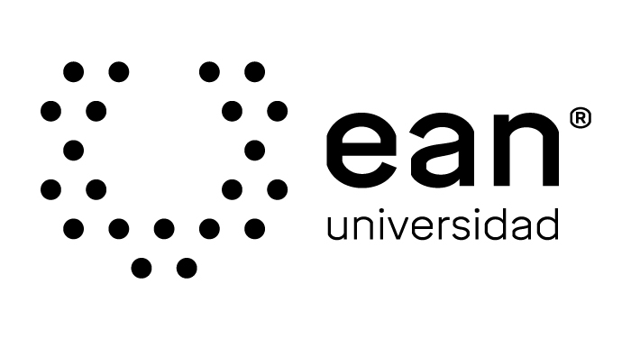

# MOOC Python Básico Universidad EAN

En este repositorio encontrarás el código fuente de los ejercicios trabajados durante el curso de programación básica

___
Los contenidos del MOOC son:

Introducción
1. Modulo 1 Fundamentos
1. Modulo 2 Tipos de datos simples
1. Modulo 3 Funciones
1. Modulo 4 Estructuras de decisión
1. Modulo 5 Estructuras de repetición
1. Modulo 6 Listas